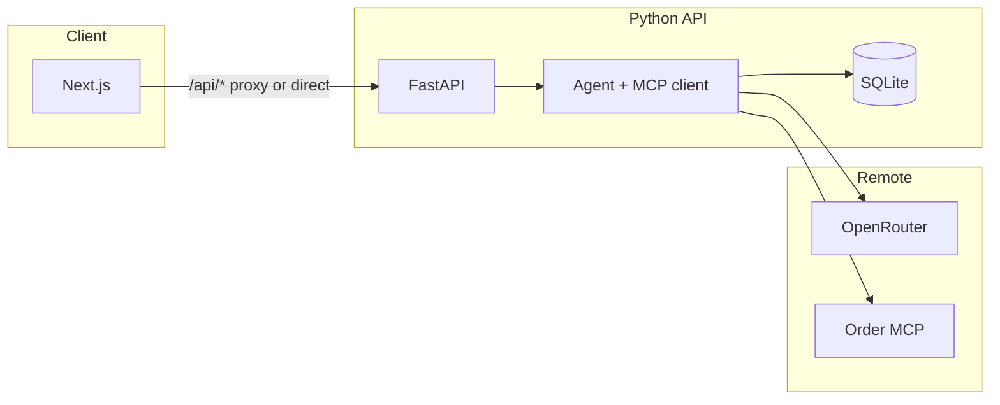

Check out the configuration reference at https://huggingface.co/docs/hub/spaces-config-reference

This Space runs from the repo **Dockerfile** (`sdk: docker`). Fields like `app_file` / `sdk_version` apply to **Gradio** or **static** Spaces, not this layout.

# Meridian Support Chat

**Production**

- **Vercel:** https://andela-final-assess-git-8ddd4b-parveenayesha1109-1528s-projects.vercel.app/
- **Hugging Face:** https://huggingface.co/spaces/meayesha24/Andela-Final-Assessment

**Meridian Support Chat** is a prototype AI assistant for **Meridian Electronics** customer support. It answers questions about products, availability, orders, and verified customers by calling a **remote order MCP** (Streamable HTTP). The model runs through **OpenRouter**; the UI streams tokens over **SSE**; **session memory** lives in **SQLite** on the Python host.

<p align="center">
  <a href="https://www.python.org/"></a>
  <a href="https://fastapi.tiangolo.com/"></a>
  <a href="https://docs.pydantic.dev/"></a>
  <a href="https://docs.astral.sh/uv/"></a>
  <a href="https://pytest.org/"></a>
  <a href="https://nextjs.org/"></a>
  <a href="https://react.dev/"></a>
  <a href="https://nodejs.org/"></a>
  <a href="https://clerk.com/"></a>
  <a href="https://openrouter.ai/"></a>
  <a href="https://modelcontextprotocol.io/"></a>
</p>

## Architecture

### Overview

Operators use the **Next.js** app (App Router). Browser calls go to **`/api/*`** on the same origin when you use the **Vercel server proxy**, or directly to the **FastAPI** origin when **`NEXT_PUBLIC_API_URL`** is set. FastAPI runs the **OpenAI Agents SDK** agent with a **Streamable HTTP** MCP client to the Meridian order server, persists turns in **SQLite** (`SQLiteSession`), and streams **SSE** from **`POST /api/chat/stream`**. Optional **Clerk** JWT verification ties signed-in users to scoped session keys; anonymous chat uses a per-visit session id.

### Diagram



---

## Table of contents

- [Architecture](#architecture)
- [Why this project](#why-this-project)
- [What you get](#what-you-get)
- [Repository layout](#repository-layout)
- [Prerequisites](#prerequisites)
- [Quick start](#quick-start)
- [Configuration](#configuration)
- [Running locally](#running-locally)
- [API overview](#api-overview)
- [Frontend](#frontend)
- [Vercel](#vercel)
- [Hugging Face Space](#hugging-face-space-docker)
- [Tests](#tests)
- [Documentation](#documentation)
- [Tech stack](#tech-stack)
- [Version](#version)

---

## Why this project

Support teams field repeat questions about catalog, stock, orders, and identity checks. This repo implements a **single conversational surface** backed by **tool-using agents** and a **real remote MCP** so answers stay grounded in Meridian systems instead of free-form hallucination.

---

## What you get

- **Streaming chat** — Server-Sent Events token stream from FastAPI.
- **Session memory** — SQLite-backed agent session; **new browser visit = new thread** (anonymous uuid per load; Clerk users use `thread_id` scoped to the signed-in user).
- **Remote MCP** — Catalog, orders, and customer tools over **Streamable HTTP** (configurable `MCP_SERVER_URL`).
- **OpenRouter** — OpenAI-compatible chat completions; keys stay on the **Python** host.
- **Optional Clerk** — Sign-in on Vercel; JWT verification on the API when `CLERK_JWKS_URL` is set.
- **Deploy paths** — **Vercel** for the full Next + Clerk UI; **Docker / Hugging Face** for a static-export UI served beside the API from one container.

---

## Repository layout

| Path | Purpose |
|------|---------|
| [backend/](backend/) | FastAPI app, agent runner, MCP client, Clerk helpers, OpenRouter config |
| [backend/api/main.py](backend/api/main.py) | HTTP routes: stream, history, health |
| [frontend/](frontend/) | Next.js 15 App Router chat UI |
| [frontend/app/api/[[...path]]/](frontend/app/api/[[...path]]/) | Same-origin proxy to FastAPI (removed in Docker static export) |
| [frontend/docker-hf/](frontend/docker-hf/) | Static-export UI variant for Docker / HF (no Clerk SDK) |
| [scripts/](scripts/) | [scripts/dev.sh](scripts/dev.sh), [scripts/run-backend.sh](scripts/run-backend.sh) |
| [run_local.py](run_local.py) | Starts backend + frontend together |
| [problem_statement.md](problem_statement.md) | Assessment brief |
| [.env.example](.env.example) | Environment variable reference |

---

## Prerequisites

- **Python** ≥ 3.12
- **[uv](https://docs.astral.sh/uv/)** for Python installs and commands
- **Node.js** LTS and **npm** (for the frontend)

---

## Quick start

1. **Clone** the repository and open the repo root.

2. **Environment**

   ```bash
   cp .env.example .env
   ```

   Set **`OPENROUTER_API_KEY`** at minimum ([OpenRouter keys](https://openrouter.ai/keys)).

3. **Frontend dependencies** (first run)

   ```bash
   cd frontend && npm install && cd ..
   ```

4. **Run API + UI** (recommended)

   ```bash
   python run_local.py
   ```

   Or: `./scripts/dev.sh` from the repo root (`FRONT_PORT` changes the Next port in that script).

   - **API:** [http://127.0.0.1:8000](http://127.0.0.1:8000) by default (override with `PORT` / `HOST` in `.env`)
   - **UI:** [http://localhost:3000](http://localhost:3000) (`npm run dev` in [frontend/package.json](frontend/package.json))

---

## Configuration

Copy [.env.example](.env.example) to **`.env`** at the repo root. The FastAPI app loads it automatically.

### LLM (OpenRouter)

| Variable | Purpose |
|----------|---------|
| `OPENROUTER_API_KEY` | Required for chat |
| `OPENROUTER_MODEL` | Default model id (e.g. `openai/gpt-4o-mini`) |
| `OPENROUTER_BASE_URL` | OpenAI-compatible base (default OpenRouter) |

### MCP

| Variable | Purpose |
|----------|---------|
| `MCP_SERVER_URL` | Streamable HTTP MCP URL (repo default points at the assessment order server) |

### Data

| Variable | Purpose |
|----------|---------|
| `DATA_DIR` / `AGENT_DB_PATH` | SQLite location (defaults under `backend/data/`) |

### Clerk (optional)

| Where | Variables |
|-------|-----------|
| **Next / Vercel** | `NEXT_PUBLIC_CLERK_PUBLISHABLE_KEY`, `CLERK_SECRET_KEY` |
| **Python API** | `CLERK_JWKS_URL`, optional `CLERK_ISSUER` |
| **Behavior** | `CLERK_AUTH_OPTIONAL`, `CLERK_AUTH_STRICT` — see [.env.example](.env.example) |

### CORS

| Variable | Purpose |
|----------|---------|
| `CORS_ORIGINS` | Comma-separated browser origins for **direct** API calls. If empty, local dev defaults apply; production previews often need your `https://*.vercel.app` origin when using **`NEXT_PUBLIC_API_URL`**. |

### Next.js / Vercel bridge

| Variable | Purpose |
|----------|---------|
| `NEXT_PUBLIC_API_URL` | Browser calls this origin for `/api/*` when set and valid |
| `API_PROXY_ORIGIN` | **Server-side** on Vercel: proxy target for same-origin `/api/*` (keep `OPENROUTER_API_KEY` off Vercel) |
| `LOCAL_API_ORIGIN` | Local Next only: proxy target when the two above are empty (default `http://127.0.0.1:8000`) |

---

## Running locally

### API + Next together

```bash
python run_local.py
```

### Backend only

```bash
cd backend
uv sync
uv run uvicorn api.main:app --reload --host 127.0.0.1 --port 8000
```

Or from the repo root: `./scripts/run-backend.sh` (honors `HOST` / `PORT`).

### Frontend only

```bash
cd frontend
npm install
npm run dev
```

Without `NEXT_PUBLIC_API_URL`, the dev server proxies `/api/*` to **`LOCAL_API_ORIGIN`** (default `http://127.0.0.1:8000`).

### Single origin (static UI inside FastAPI)

```bash
cd frontend && npm run build
node scripts/copy-static.mjs
cd ../backend && PYTHONPATH=. uv run uvicorn api.main:app --host 127.0.0.1 --port 8000
```

Open [http://127.0.0.1:8000](http://127.0.0.1:8000); leave `NEXT_PUBLIC_API_URL` empty so assets and `/api` share one origin.

**Health:** `GET http://127.0.0.1:8000/api/health`

---

## API overview

Base URL in local development: **`http://127.0.0.1:8000`**

| Method | Path | Purpose |
|--------|------|---------|
| `POST` | `/api/chat/stream` | Chat body: `message`, `session_id`; optional `thread_id` (Clerk-scoped visit) — **SSE** response |
| `GET` | `/api/session/{session_id}/history` | Optional query `thread_id` (with Clerk) — JSON messages |
| `GET` | `/api/health` | Liveness and config flags |

OpenAPI: **`/docs`** when the server exposes it (may be absent if static mount wins in some builds).

---

## Frontend

Next.js **App Router** under [frontend/app/](frontend/app/):

| Area | Detail |
|------|--------|
| **Chat** | [frontend/app/ChatShell.tsx](frontend/app/ChatShell.tsx) — stream parse, history load |
| **Auth** | If `NEXT_PUBLIC_CLERK_PUBLISHABLE_KEY` is set, [frontend/app/page.tsx](frontend/app/page.tsx) uses Clerk (`SignedIn` / `SignedOut`); otherwise anonymous chat |
| **Env** | [frontend/next.config.ts](frontend/next.config.ts) loads the **repo root** `.env` for `NEXT_PUBLIC_*` |

`STATIC_EXPORT=true` is for **Docker / HF** only; on Vercel, `VERCEL=1` avoids forcing static export so **`/api/*` route handlers** stay available.

---

## Vercel (frontend)

Deploy from **`frontend/`** only:

1. **Root Directory:** `frontend` — Framework: **Next.js**. Do **not** point output at `out` unless you intentionally static-export; otherwise **`/api/*` returns 404**.
2. **Secrets:** Do **not** put `OPENROUTER_API_KEY` on Vercel. Set **`API_PROXY_ORIGIN`** (Production + Preview) to your public **Python** HTTPS origin, or set **`NEXT_PUBLIC_API_URL`** for direct browser → API (then set **`CORS_ORIGINS`** on Python).
3. **Proxy:** [frontend/app/api/[[...path]]/route.ts](frontend/app/api/[[...path]]/route.ts) forwards methods and headers to `API_PROXY_ORIGIN`. [frontend/vercel.json](frontend/vercel.json) sets `"framework": "nextjs"`.
4. **Clerk:** Mirror `NEXT_PUBLIC_CLERK_PUBLISHABLE_KEY` and `CLERK_SECRET_KEY` from `.env`; configure JWKS on the Python host as above.

---

## Hugging Face Space (Docker)

1. Create a **Docker** Space; the repo **[Dockerfile](Dockerfile)** builds the image.
2. Set **`OPENROUTER_API_KEY`** in Space variables (and optional model / MCP overrides).
3. The image serves the **exported** UI and API on the Space `PORT`. **`frontend/docker-hf/`** replaces the default app for static export (**no Clerk** in that bundle).
4. If you copied Clerk JWKS into Space env, use an image that supports **`CLERK_AUTH_OPTIONAL=1`** on HF or omit JWKS for anonymous-only demos.

---

## Tests

From the repo root:

```bash
cd backend && uv sync --extra dev && uv run pytest
```

Optional **live MCP** integration tests:

```bash
RUN_MCP_INTEGRATION=1 uv run pytest
```

---

## Documentation

| Document | Contents |
|----------|----------|
| [problem_statement.md](problem_statement.md) | Assessment problem brief |
| [.env.example](.env.example) | Full variable list and comments |

---

## Tech stack

| Category | Stack |
|----------|--------|
| **Language** | Python 3.12+, TypeScript |
| **Backend** | FastAPI, Uvicorn, Pydantic v2, PyJWT, OpenAI Agents SDK, MCP client, SQLite (`agents` memory) |
| **Frontend** | Next.js 15, React 19, App Router, Clerk (optional), Turbopack dev |
| **LLM** | OpenRouter (OpenAI-compatible Chat Completions) |
| **Integrations** | Remote order MCP over Streamable HTTP |
| **Tooling** | uv, npm, pytest |

---

## Version

Backend package version: **0.1.0** ([backend/pyproject.toml](backend/pyproject.toml)). Frontend is private **meridian-support-chat** ([frontend/package.json](frontend/package.json)).
